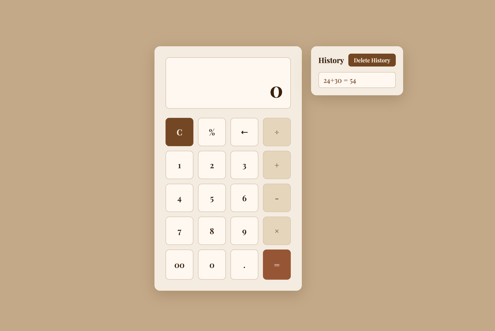

# 🤎 calculator

a clean, minimal calculator with a warm aesthetic.
built from scratch with vanilla html, css, and javascript.

&nbsp;

&nbsp;

---

✦ preview

---

✦ features

- basic arithmetic — add, subtract, multiply, divide
- percentage calculation
- decimal support
- backspace to delete last digit
- full keyboard support — just type and calculate
- calculation history panel
- delete history option

---

*clean design. messy code. learning everyday.* 🤎
